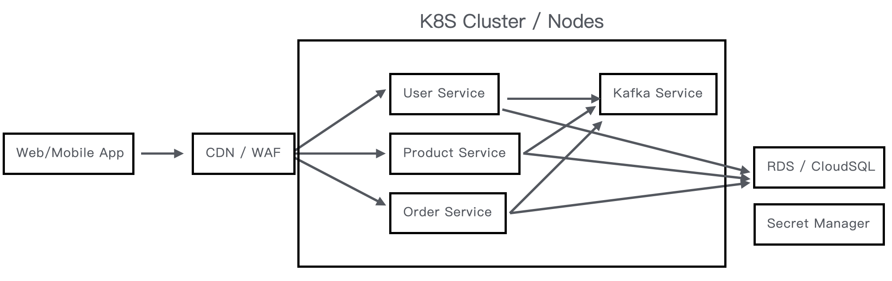

### Directory
`src` API Server, Using NodeJs/Express, provide User/Product/Order service sample API.
`k8s` Kubernetes configuration files, includes API server / Kafka / Secret protecton
`terraform_aws` Deploy EKS / RDS / SSM services on AWS
`terraform_gcp` Deploy GKE / CloudSQL / Secret Manager services on GCP
`drone` Setup Drone config by AWS or GCP

### Basic Infrastructure


### CI/CD Flow chart


### Push API Server to GCR
docker build -t gcr.io/<PROJECT_ID>/node-api:<VERSION> .
gcloud auth configure-docker
docker push gcr.io/<PROJECT_ID>/node-api:<VERSION>

### Deploy infra to GCP
**Deploy**
```
cd terraform_gcp
terraform init
terraform apply
```
**Destroy**
```
terraform destroy
```

### Deploy infra to AWS
**Deploy**
```
cd terraform_aws
terraform init
terraform apply
```
**Destroy**
```
terraform destroy
```
